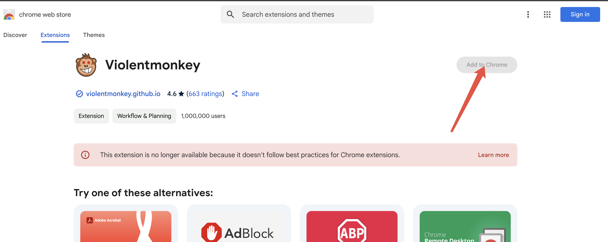
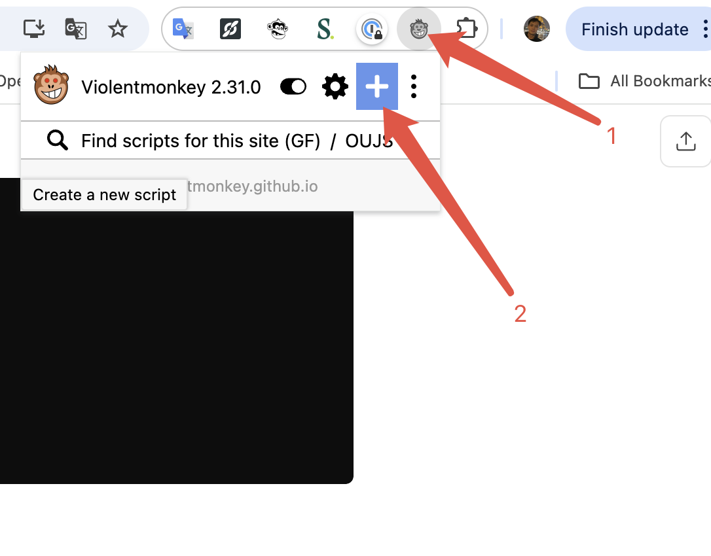
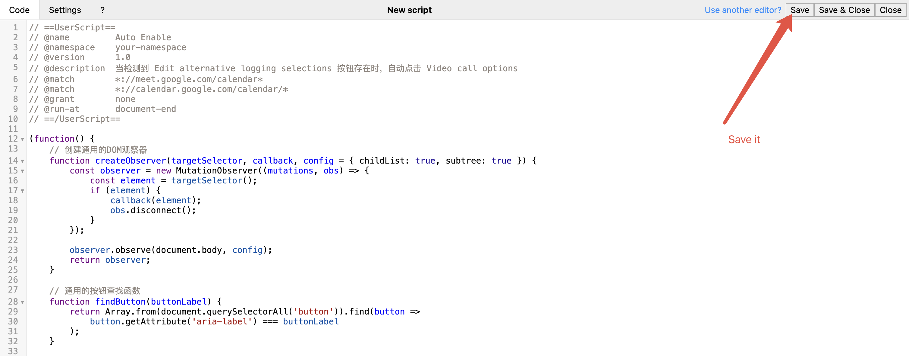

# Auto Enable Meeting Recording
[English](#english) | [中文](#中文)

## English

### Introduction
This script automatically enables meeting recording settings in Google Calendar/Meet. It helps users automatically configure recording settings when creating meetings 

### ❗ONLY for Salesloft Meetings❗ And Have to Install Salesloft Chrome extension too

### Features
- Automatically detects and clicks the "Video call options" button when available
- Automatically enables meeting recording in settings
- Prevents duplicate configurations within 1 minute
- Works with both Google Calendar and Google Meet

### Installation Guide

#### Step 1: Install Violentmonkey
1. Visit the Chrome Web Store
2. Search for "Violentmonkey" or [click here](https://chrome.google.com/webstore/detail/violentmonkey/jinjaccalgkegednnccohejagnlnfdag)
3. Click "Add to Chrome" to install the extension

#### Step 2: Install the Script
1. Click the Violentmonkey icon in your browser
2. Click the "+" button to create a new script
3. Copy the entire content from `index.js` (if doesn't work use index-v2.js)
4. Paste it into the editor
5. Click "Save" (Ctrl+S)

### Usage
After installation, the script will automatically run when you:
1. Create a new meeting in Google Calendar
2. Access meeting settings

No additional configuration is needed.

### Troubleshooting
If the script doesn't work:
- Make sure Violentmonkey is enabled
- Refresh the page
- Check if the script is enabled in Violentmonkey's dashboard

---

## 中文

### 简介
这个脚本可以自动启用 Google Calendar/Meet 的会议录制设置。它能帮助用户在创建会议时自动配置录制设置。

### ❗只对 Salesloft 的会议生效❗必须安装 Salesloft 插件

### 功能特点
- 自动检测并点击"视频通话选项"按钮
- 自动启用会议录制设置
- 1分钟内防止重复配置
- 支持 Google Calendar 和 Google Meet

### 安装指南

#### 第一步：安装 Violentmonkey
1. 访问 Chrome 网上应用店
2. 搜索 "Violentmonkey" 或[点击这里](https://chrome.google.com/webstore/detail/violentmonkey/jinjaccalgkegednnccohejagnlnfdag)
3. 点击"添加至 Chrome"安装扩展

#### 第二步：安装脚本
1. 点击浏览器中的 Violentmonkey 图标
2. 点击"+"按钮创建新脚本
3. 复制 `index.js` 中的所有内容 (如果不能用可以切换到index-v2.js)
4. 粘贴到编辑器中
5. 点击保存（Ctrl+S）

### 使用方法
安装完成后，脚本会在以下情况自动运行：
1. 在 Google Calendar 中创建新会议
2. 访问会议设置

无需额外配置。

### 故障排除
如果脚本不工作：
- 确保 Violentmonkey 已启用
- 刷新页面
- 检查 Violentmonkey 面板中脚本是否启用
