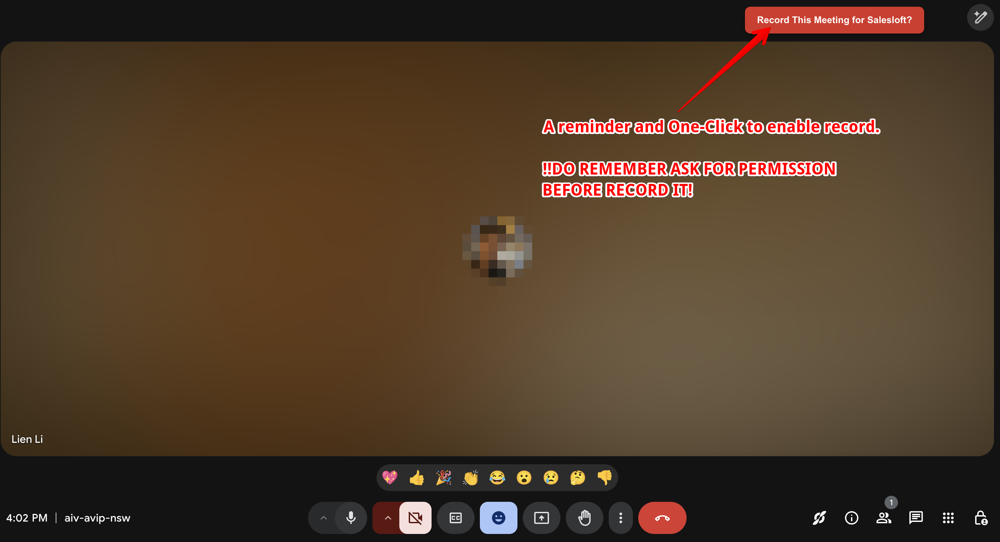

# Google Meet Recording Solutions
[English](#english) | [中文](#中文)

## English

### Introduction
This repository provides two different solutions for managing Google Meet recording:

#### 1. Auto Enable Record for Saleloft Meeting (index.js)
- Automatically enables meeting recording when creating meetings
- ❗Requires [Salesloft Chrome extension](https://chromewebstore.google.com/detail/salesloft-connect/ejgmneenioanldgngdomlfnbcbffmchf)
- Best for teams who always need recording enabled by default
- Configuration happens during meeting creation

#### 2. Google Meet One-Click Recording for Salesloft (Permission Ask Style) (index-permission-ask.js)
- Asks for recording permission when joining the meeting
- No Salesloft extension requirement
- More flexible approach respecting client preferences
- Suitable for teams who need to confirm recording permission with clients

When using this solution, you'll see a permission prompt like this:

Choose the solution that best fits your workflow needs.

### Features

#### For Auto Enable Record for Saleloft Meeting:
- Automatically detects and clicks the "Video call options" button when available
- Automatically enables meeting recording in settings
- Prevents duplicate configurations within 1 minute
- Works with both Google Calendar and Google Meet
- ❗Requires Salesloft Chrome extension

#### For Google Meet One-Click Recording:
- Prompts for recording permission when joining the meeting
- Works with both Google Calendar and Google Meet
- Respects user privacy and consent
- No additional extension requirements
- Prevents duplicate configurations within 1 minute

### Installation Guide

#### Step 1: Install Violentmonkey
1. Visit the Chrome Web Store
2. Search for "Violentmonkey" or [click here](https://chrome.google.com/webstore/detail/violentmonkey/jinjaccalgkegednnccohejagnlnfdag)
3. Click "Add to Chrome" to install the extension

#### Step 2: Install the Script
1. Click the Violentmonkey icon in your browser
2. Click the "+" button to create a new script
3. Copy the entire content from either `index.js` or `index-permission-ask.js` based on your chosen solution
4. Paste it into the editor
5. Click "Save" (Ctrl+S)

### Usage

#### For Auto Enable Record for Saleloft Meeting:
After installation, the script will automatically run when you:
1. Create a new meeting in Google Calendar
2. Access meeting settings

#### For Google Meet One-Click Recording:
After installation:
1. The script will automatically run when you join a meeting
2. You will be prompted to enable recording when joining the meeting
3. Choose whether to enable recording based on the client's preference

### Troubleshooting
If the script doesn't work:
- Make sure Violentmonkey is enabled
- Make sure you've installed the correct script for your needs
- Refresh the page
- Check if the script is enabled in Violentmonkey's dashboard
- For Auto Enable solution, verify Salesloft extension is installed

---

## 中文

### 简介
本仓库提供两种不同的 Google Meet 录制管理方案：

#### 1. Auto Enable Record for Saleloft Meeting (index.js)
- 创建会议时自动启用录制功能
- ❗必须安装 Salesloft Chrome 插件
- 适合需要默认开启录制的团队
- 在创建会议时就完成设置

#### 2. Google Meet One-Click Recording for Salesloft (Permission Ask Style) (index-permission-ask.js)
- 加入会议时询问是否录制
- 无需安装 Salesloft 插件
- 更灵活的方案，尊重客户意愿
- 适合需要与客户确认录制权限的团队

使用此方案时，您将看到如下权限提示：

请根据您的工作流程需求选择合适的方案。

### 功能特点

#### Auto Enable Record for Saleloft Meeting:
- 自动检测并点击"视频通话选项"按钮
- 自动启用会议录制设置
- 1分钟内防止重复配置
- 支持 Google Calendar 和 Google Meet
- ❗需要安装 Salesloft Chrome 插件

#### Google Meet One-Click Recording:
- 加入会议时询问录制权限
- 支持 Google Calendar 和 Google Meet
- 尊重用户隐私和同意
- 无需额外插件
- 1分钟内防止重复配置

### 安装指南

#### 第一步：安装 Violentmonkey
1. 访问 Chrome 网上应用店
2. 搜索 "Violentmonkey" 或[点击这里](https://chrome.google.com/webstore/detail/violentmonkey/jinjaccalgkegednnccohejagnlnfdag)
3. 点击"添加至 Chrome"安装扩展

#### 第二步：安装脚本
1. 点击浏览器中的 Violentmonkey 图标
2. 点击"+"按钮创建新脚本
3. 根据您选择的方案复制 `index.js` 或 `index-permission-ask.js` 中的内容
4. 粘贴到编辑器中
5. 点击保存（Ctrl+S）

### 使用方法

#### Auto Enable Record for Saleloft Meeting:
安装完成后，脚本会在以下情况自动运行：
1. 在 Google Calendar 中创建新会议
2. 访问会议设置

#### Google Meet One-Click Recording:
安装完成后：
1. 加入会议时脚本会自动运行
2. 进入会议时会询问是否启用录制
3. 根据客户意愿选择是否开启录制

### 故障排除
如果脚本不工作：
- 确保 Violentmonkey 已启用
- 确保安装了正确的脚本版本
- 刷新页面
- 检查 Violentmonkey 面板中脚本是否启用
- 对于自动启用方案，确认已安装 Salesloft 插件
